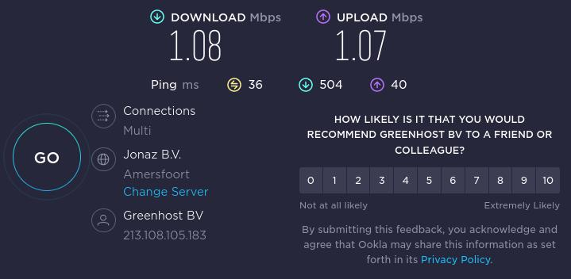

# Psiphond  client

Checkout https://github.com/AlexanderWiechert/psiphon-server and build server as described there.

```
docker build -t psiphon-client .
docker run --rm -it psiphon-client:latest
```
Copy Token from psiphon-server output and paste it under _**TargetServerEntry**_ in client.conf

Start container and add 127.0.0.1 8081 as Proxy in your browser.

```
{
"LocalHttpProxyPort" : 8081,
"LocalSocksProxyPort" : 1081,
"PropagationChannelId" : "FFFFFFFFFFFFFFFF",
"SponsorId" :            "FFFFFFFFFFFFFFFF",
"TargetServerEntry" : "__TOKEN__"
}
```

## Speedtest
This is the speedtest result when running both server and client on localhost.


# Alexander Wiechert // Elastic2ls

[Website](https://www.elastic2ls.com/)

[Contact](info@elastic2ls.com)

[License](https://github.com/AlexanderWiechert/.github/blob/main/LICENSE)
